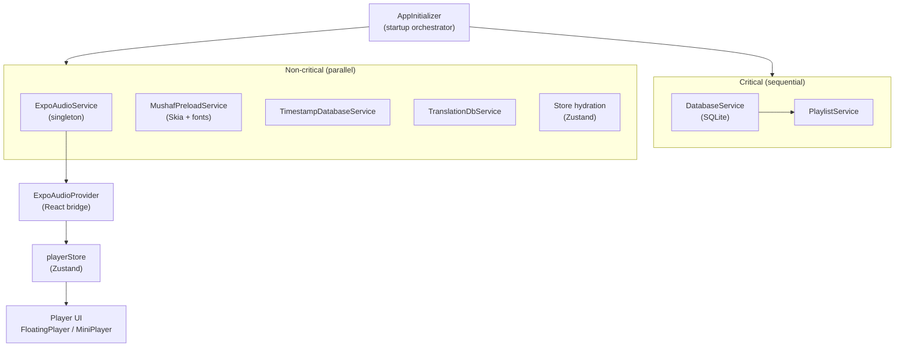

# Bayaan

**Open-source Quran recitation app for iOS and Android**

Bayaan lets you listen to Quran recitations from 200+ reciters with background audio support, a full Uthmani Mushaf, Adhkar, offline downloads, playlists, and ambient sounds.

[React Native](https://reactnative.dev)
[Expo](https://expo.dev)
[TypeScript](https://www.typescriptlang.org)
[License](LICENSE)

---

## Features

- **Quran Player** — Stream or download recitations from 200+ reciters across multiple rewayat. Background playback, lock screen controls, sleep timer, playback speed, and repeat modes.
- **Digital Mushaf** — Full Uthmani text rendered with [Digital Khatt](docs/features/digital-khatt/README.md) using Skia. Verse follow-along synced to audio playback, multiple reading themes.
- **Multi-Qira'at (Rewayat)** — All 8 canonical KFGQPC [rewayat](docs/features/rewayat.md) selectable from settings (Hafs, Shu'bah, Al-Bazzi, Qunbul, Warsh, Qalun, Al-Duri, Al-Susi). Published-mushaf-style highlighting for differences from Hafs; context flows into player text, share surfaces, and saved annotations.
- **Adhkar** — Comprehensive collection of daily Adhkar and Du'a with audio, counters, and saved favorites.
- **Offline Downloads** — Download any reciter's complete Quran for offline playback. Persistent download management with progress tracking.
- **Playlists** — Create and manage custom playlists backed by SQLite.
- **Ambient Sounds** — Layer nature sounds (rain, ocean, forest, etc.) over recitation audio.
- **Search** — Fast fuzzy search across reciters and surahs using Fuse.js.
- **Translations & Tafseer** — Multiple translation languages and tafseer editions, downloadable for offline use.
- **Word-by-Word** — Arabic word-by-word translation overlay in the Mushaf view.
- **Themes** — Light and dark mode with multiple Mushaf reading themes.
- **i18n** — Internationalisation via react-i18next with RTL support.

---

## Tech Stack


| Layer            | Technology                          |
| ---------------- | ----------------------------------- |
| Framework        | React Native 0.83 + Expo SDK 55     |
| Navigation       | Expo Router v4 (file-based)         |
| Audio            | expo-audio with background playback |
| Mushaf rendering | @shopify/react-native-skia          |
| State management | Zustand                             |
| Database         | expo-sqlite                         |
| Fast storage     | react-native-mmkv                   |
| Lists            | @shopify/flash-list                 |
| Animations       | react-native-reanimated 4           |
| Images           | expo-image                          |
| Backend          | Supabase + custom REST API          |


---

## Architecture




For a full architecture walkthrough see [docs/architecture/current-state.md](docs/architecture/current-state.md).

---

## Getting Started

### Prerequisites

- Node.js 18+
- [Expo CLI](https://docs.expo.dev/get-started/installation/): `npm install -g expo-cli`
- For iOS: macOS with Xcode 15+
- For Android: Android Studio with an emulator

### Install

```bash
git clone https://github.com/thebayaan/Bayaan.git
cd Bayaan
npm install
```

### Configure environment

```bash
cp .env.example .env
```

Open `.env` and set your API key. For local development, use the **community key** (see [CONTRIBUTING.md](CONTRIBUTING.md#api-key-for-development) or ask in a pinned GitHub issue):

```
EXPO_PUBLIC_BAYAAN_API_URL=https://api.thebayaan.com
EXPO_PUBLIC_BAYAAN_API_KEY=<community key>
```

### Run

```bash
# Start the Expo dev server
npm start

# Run on iOS simulator (macOS only)
npm run ios

# Run on Android emulator
npm run android
```

---

## Project Structure

```
Bayaan/
├── app/                    # Expo Router screens
│   ├── (tabs)/             # Main tab navigator
│   │   ├── (a.home)/       # Home tab
│   │   ├── (b.search)/     # Search tab
│   │   ├── (b.surahs)/     # Surahs tab
│   │   ├── (c.collection)/ # Collection tab (downloads, playlists, etc.)
│   │   └── (d.settings)/   # Settings tab
│   ├── share/              # Deep link share targets
│   └── mushaf.tsx          # Full-screen Mushaf reader
├── components/             # Reusable UI components
├── services/               # Business logic and service singletons
│   ├── audio/              # ExpoAudioService, ExpoAudioProvider, AmbientAudioService
│   ├── player/             # playerStore, downloadStore, and player utilities
│   ├── mushaf/             # Digital Khatt rendering services
│   ├── database/           # SQLite service wrappers
│   └── AppInitializer.ts   # App startup orchestrator
├── store/                  # Zustand stores (24 modules)
├── types/                  # TypeScript type definitions
├── constants/              # App-wide constants
├── hooks/                  # Custom React hooks
├── data/                   # Static data (reciters.json, surahs.json)
├── assets/                 # Fonts, images, audio
└── docs/                   # Full documentation
```

---

## Documentation

Full documentation lives in the `[docs/](docs/README.md)` directory:

- [Architecture overview](docs/architecture/current-state.md)
- [Player system](docs/features/player.md)
- [Digital Khatt / Mushaf](docs/features/digital-khatt/README.md)
- [Downloads](docs/features/downloads.md)
- [Deployment guide](docs/deployment/deployment.md)
- [Contributing guide](CONTRIBUTING.md)
- [Self-hosting](docs/contributing/self-hosting.md)

---

## Contributing

Contributions are welcome. Please read [CONTRIBUTING.md](CONTRIBUTING.md) before opening a pull request.

Key points:

- Branch off `develop`, never `main`
- Run `npx prettier --write` and `npx tsc --noEmit` before submitting
- Test on both iOS and Android

---

## License

This project is licensed under **Apache 2.0 with the Commons Clause**.

In plain English: you are free to use, study, and modify this code for non-commercial purposes. You may not sell the software, offer it as a commercial product or service, or build a revenue-generating product substantially derived from it without written permission from the Bayaan project.

See [LICENSE](LICENSE) for the full terms.

---

## Screenshots

> Coming soon — contributions welcome.

---

Built with care for the Muslim community.