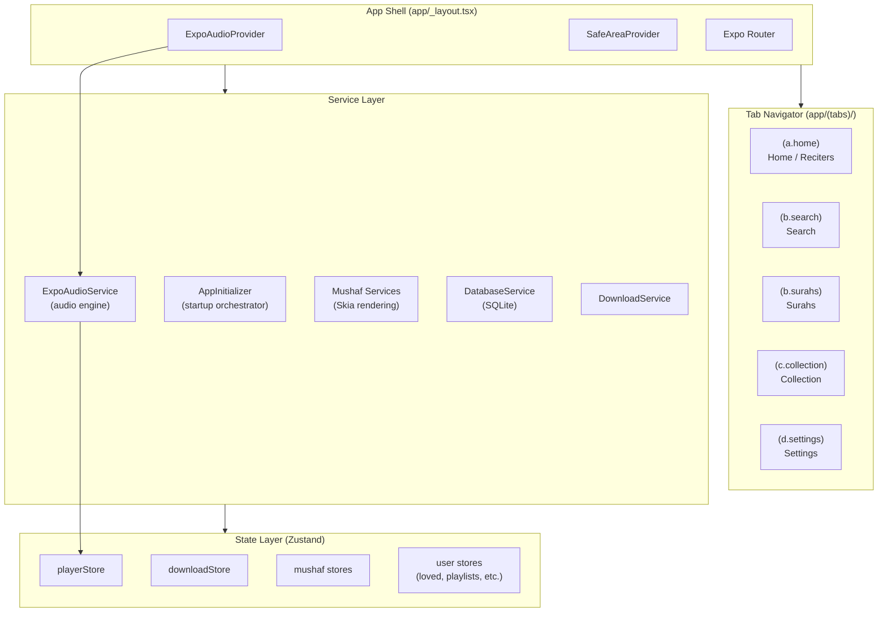
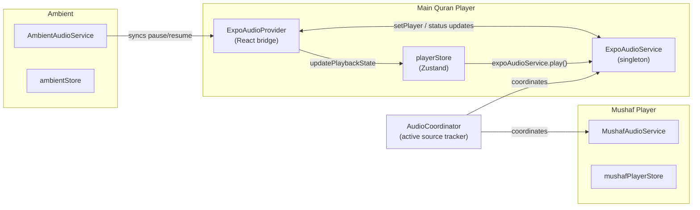

# Architecture Overview

This document describes the current architecture of Bayaan — the app's layers, how they fit together, and where to find what.

> **Stack:** React Native 0.83 · Expo SDK 55 · Expo Router v4 · expo-audio · Zustand · expo-sqlite · MMKV · Skia

---

## High-level structure




---

## App startup sequence

`AppInitializer` (`services/AppInitializer.ts`) orchestrates all service startup. It is called from `app/_layout.tsx` during the splash screen phase.

### Critical services (sequential)

These must succeed or the app cannot start:


| Priority | Service           | What it does                                            |
| -------- | ----------------- | ------------------------------------------------------- |
| 1        | `DatabaseService` | Opens the main SQLite database, creates all tables      |
| 2        | `PlaylistService` | Initializes playlist SQLite table (depends on Database) |


### Non-critical services (parallel)

These run simultaneously. A failure logs a warning but does not block startup:


| Priority | Service             | What it does                                                    |
| -------- | ------------------- | --------------------------------------------------------------- |
| 3        | `Playlists Data`    | Loads playlists into `playlistsStore`                           |
| 3        | `Store Hydration`   | Warms all persisted Zustand stores from AsyncStorage            |
| 4        | `Adhkar Service`    | Opens adhkar SQLite database, seeds initial data                |
| 5        | `Mushaf Preload`    | Loads DigitalKhatt data, Skia V1+V2 typefaces, surah headers    |
| 6        | `Adhkar Store Data` | Loads adhkar categories into `adhkarStore`                      |
| 6        | `Uploads Service`   | Loads user-uploaded recitations, runs orphan cleanup            |
| 7        | `Verse Annotations` | Opens verse annotations DB, warms bookmark cache                |
| 9        | `Timestamps`        | Opens timestamp cache DB, loads follow-along registry           |
| 10       | `Theme Data`        | Builds verse→theme lookup map for thematic highlighting         |
| 10       | `Arabic Fonts`      | Loads Scheherazade, Uthmani, DigitalKhatt fonts via `expo-font` |
| 10       | `QUL Data`          | Opens ayah-themes, similar-ayah, mutashabihat databases         |
| 10       | `Translation DB`    | Opens downloaded translations database                          |
| 10       | `Tafseer DB`        | Opens downloaded tafaseer database, imports bundled Ibn Kathir  |
| 10       | `WBW Data`          | Opens word-by-word translation database                         |


**Registering a new service:**

```typescript
appInitializer.registerService({
  name: 'My Service',
  priority: 8,          // lower = earlier
  critical: false,      // true = blocks startup on failure
  initialize: async () => {
    await myService.initialize();
    await useMyStore.getState().load();
  },
});
```

---

## Navigation structure

Bayaan uses **Expo Router v4** with a file-based routing system.

```
app/
├── _layout.tsx              # Root layout (providers, splash)
├── +not-found.tsx           # 404 screen
├── mushaf.tsx               # Full-screen Mushaf reader (modal)
├── share/                   # Deep link share targets
│   ├── adhkar/[superId].tsx
│   ├── playlist/[id].tsx
│   ├── reciter/[slug].tsx
│   ├── reciter/[slug]/surah/[num].tsx
│   └── mushaf/[page].tsx
└── (tabs)/
    ├── _layout.tsx          # Tab bar + FloatingPlayer
    ├── (a.home)/            # Home: reciters, playlists, browse
    ├── (b.search)/          # Search: reciters and surahs
    ├── (b.surahs)/          # Surahs browser
    ├── (c.collection)/      # Downloads, playlists, loved, bookmarks
    └── (d.settings)/        # Settings, reading themes, Mushaf settings
```

Deep links use the `bayaan://` URL scheme and `api.thebayaan.com/share` associated domain.

---

## Audio system




- The **main player** handles all reciter audio. State lives in `playerStore`.
- The **Mushaf player** handles verse-by-verse audio in the reader. State lives in `mushafPlayerStore`. The two cannot play simultaneously — `AudioCoordinator` enforces this.
- **Ambient audio** uses a separate `AudioPlayer` and syncs its pause/resume with whichever source is active.

---

## State management

Bayaan uses **Zustand** for all client state. Stores are split by domain:

### Player stores (`services/player/store/`)


| Store                   | Persisted    | Contents                                                           |
| ----------------------- | ------------ | ------------------------------------------------------------------ |
| `playerStore`           | AsyncStorage | Playback state, queue, settings (repeat/rate/sleep timer), UI mode |
| `downloadStore`         | AsyncStorage | Active + completed downloads, progress, file paths                 |
| `lovedStore`            | AsyncStorage | Loved/favourited tracks                                            |
| `recentlyPlayedStore`   | AsyncStorage | Recently played history with progress                              |
| `favoriteRecitersStore` | AsyncStorage | Favourite reciter IDs                                              |


### App stores (`store/`)


| Store                       | Persisted            | Contents                                               |
| --------------------------- | -------------------- | ------------------------------------------------------ |
| `reciterStore`              | AsyncStorage         | Loaded reciters list and rewayat                       |
| `playlistsStore`            | SQLite (via service) | Playlists and playlist tracks                          |
| `uploadsStore`              | SQLite (via service) | User-uploaded recitations                              |
| `adhkarStore`               | No                   | Adhkar categories and dhikr items (loaded from SQLite) |
| `adhkarAudioStore`          | No                   | Adhkar audio playback state                            |
| `adhkarSettingsStore`       | MMKV                 | Adhkar display preferences                             |
| `ambientStore`              | AsyncStorage         | Ambient sound selection and volume                     |
| `mushafSettingsStore`       | AsyncStorage         | Mushaf display options (theme, font size, WBW, etc.)   |
| `mushafNavigationStore`     | No                   | Current page, scroll position                          |
| `mushafPlayerStore`         | No                   | Mushaf verse playback state                            |
| `mushafVerseSelectionStore` | No                   | Selected verse in reader                               |
| `timestampStore`            | AsyncStorage         | Follow-along enabled reciters registry                 |
| `translationStore`          | AsyncStorage         | Active translation selection and downloaded metadata   |
| `tafseerStore`              | AsyncStorage         | Active tafseer and downloaded metadata                 |
| `themeStore`                | AsyncStorage         | App color scheme and reading theme                     |
| `verseAnnotationsStore`     | No                   | Loaded bookmarks, notes, highlights (from SQLite)      |
| `verseSelectionStore`       | No                   | Currently selected verse for annotation                |
| `networkStore`              | No                   | Network connectivity state                             |
| `devSettingsStore`          | AsyncStorage         | Developer flags                                        |
| `apiHealthStore`            | No                   | Backend API health status                              |
| `playCountStore`            | AsyncStorage         | Per-surah play counts                                  |
| `tajweedStore`              | AsyncStorage         | Tajweed overlay preferences                            |
| `favoriteRecitersStore`     | AsyncStorage         | Favourite reciter IDs (UI store)                       |


---

## Database layer

All persistent structured data beyond simple key-value uses **SQLite via expo-sqlite**.


| Database          | File              | Service                          | Contents                                  |
| ----------------- | ----------------- | -------------------------------- | ----------------------------------------- |
| Main app DB       | `bayaan.db`       | `DatabaseService`                | Playlists, playlist tracks                |
| Adhkar            | `adhkar.db`       | `AdhkarDatabaseService`          | Dhikr items, categories                   |
| Verse annotations | `annotations.db`  | `VerseAnnotationDatabaseService` | Bookmarks, notes, highlights              |
| Ayah timestamps   | `timestamps.db`   | `TimestampDatabaseService`       | Cached ayah timing data                   |
| Translations      | `translations.db` | `TranslationDbService`           | Downloaded translation texts              |
| Tafaseer          | `tafaseer.db`     | `TafseerDbService`               | Downloaded tafseer texts                  |
| Word-by-word      | `wbw-en.db`       | `WBWDataService`                 | English WBW translations                  |
| QUL themes        | (bundled assets)  | `QulDataService`                 | Verse themes, similar ayahs, mutashabihat |
| Mushaf uploads    | `uploads.db`      | `UploadsDatabaseService`         | User-uploaded recitation metadata         |


---

## Mushaf (Digital Khatt)

The Mushaf reader uses a full custom rendering pipeline:

1. **Data layer** — `DigitalKhattDataService` loads glyph/page JSON from `data/mushaf/digitalkhatt/`
2. **Layout engine** — `JustificationService` computes Uthmani line justification
3. **Layout cache** — `MushafLayoutCacheService` precomputes all 604 pages into MMKV for synchronous reads (~<1ms vs ~50ms compute)
4. **Rendering** — Skia canvas (`@shopify/react-native-skia`) via `components/mushaf/skia/`
5. **Reading view** — `components/mushaf/reading/` manages page scrolling, verse highlighting, and audio sync

For deep dives see [docs/features/digital-khatt/README.md](../features/digital-khatt/README.md).

---

## Rewayat (multi-qira'at)

The mushaf renders any of the 8 canonical KFGQPC rewayat — Hafs, Shu'bah, Al-Bazzi, Qunbul, Warsh, Qalun, Al-Duri, Al-Susi — selectable from Mushaf Settings. Each ships as a Hafs-layout sibling: shared `dk_layout.db`, per-rewayah `dk_words_<id>.db`.

- `DigitalKhattDataService` holds one active rewayah for the mushaf and a side cache (up to 7 entries, ~4 MB) for surfaces that need a different one (typically the player rendering the reciter's rewayah). `ensureRewayahLoaded(rewayah)` populates the side cache on demand.
- `RewayahDiffService` loads a per-rewayah diff JSON describing which words differ from Hafs and what highlight category applies. Two channels: background tint for whole-word variants (`major`, `mukhtalif`), foreground color for letter-level rules (`madd`, `tashil`, `ibdal`, `taghliz`, `silah`, `minor`).
- Copy/share surfaces resolve Arabic text from DK in the current-context rewayah and stamp the short rewayah label on non-Hafs output (text, image, URL `?rewayah=<id>`).
- Verse bookmarks / notes / highlights persist a nullable `rewayah_id`; legacy rows are backfilled to `'hafs'`. Opening a saved item silently restores the saved rewayah before navigating.
- Word-by-word locks to Hafs regardless of context (WBW data is Hafs-aligned) with a disclosure.

For deep dive see [docs/features/rewayat.md](../features/rewayat.md).

---

## Analytics

Phase 1 shipped: event tracking, local aggregation, Sentry crash reporting.

- `services/analytics/AnalyticsService.ts` — PostHog-backed event client with killswitch and opt-out.
- `services/analytics/LocalAggregationStore.ts` — MMKV daily buckets feeding a future stats dashboard.
- `services/analytics/MeaningfulListenTracker.ts` — 30s / 10% threshold before counting a listen.
- Instrumented surfaces: player (play, skip, seek, rate change), mushaf navigation, adhkar interactions, search, translation views, reciter interactions, playlists, share creation, app lifecycle.

For deep dive see [docs/features/analytics.md](../features/analytics.md).

---

## Key patterns

### Pressable over TouchableOpacity

```tsx
// Correct
<Pressable style={({pressed}) => [styles.row, pressed && styles.pressed]}>

// Avoid
<TouchableOpacity>
```

### FlashList over FlatList

```tsx
import {FlashList} from '@shopify/flash-list';
// Use FlashList for all scrollable lists
```

### Zero-re-render action hooks

```typescript
// For action dispatch only — no re-renders
const { play, pause } = usePlayerActions();

// For reading state — re-renders on change
const isPlaying = usePlayerStore(s => s.playback.state === 'playing');
```

### Alpha-based color tokens

```typescript
// Do this
Color(theme.colors.text).alpha(0.04).toString()  // card background

// Never do this
theme.colors.primary  // accent/primary colors are not used for UI chrome
```

---

## Configuration

App config lives in `app.config.js` (there is no `app.json`). Versioning is driven by git tags via `scripts/generate-version.js`. See [docs/deployment/version-management.md](../deployment/version-management.md).