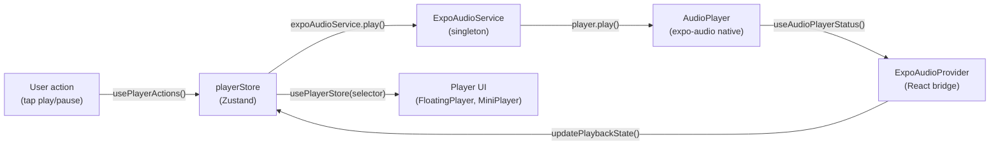

# Player System

This document describes the Bayaan audio player architecture — how playback works, how state flows, and how to extend the system.

---

## Overview

The player is built on [expo-audio](https://docs.expo.dev/versions/latest/sdk/audio/) and consists of three layers:

1. **ExpoAudioService** — a singleton that wraps the native `AudioPlayer` and exposes imperative playback commands
2. **ExpoAudioProvider** — a React provider mounted at the app root that bridges the native player to the Zustand store
3. **playerStore** — a Zustand store (persisted via AsyncStorage) that is the single source of truth for all player state

---

## Data flow



---

## Components

### ExpoAudioService (`services/audio/ExpoAudioService.ts`)

Singleton class. Owns the connection to the native `AudioPlayer` instance and exposes imperative methods:

| Method | Description |
|--------|-------------|
| `initialize()` | Set up audio mode for background playback (call once at startup) |
| `setPlayer(player)` | Bind the React `AudioPlayer` instance created by the provider |
| `loadUrl(url)` | Load an audio URL without playing |
| `play()` | Resume or start playback |
| `pause()` | Pause playback |
| `seekTo(seconds)` | Seek to a position |
| `setRate(rate)` | Set playback rate (0.5–2.0) |

```typescript
import {expoAudioService} from '@/services/audio/ExpoAudioService';
```

### ExpoAudioProvider (`services/audio/ExpoAudioProvider.tsx`)

Must be mounted at the app root (`app/_layout.tsx`). Responsibilities:
- Creates the `AudioPlayer` instance via `useAudioPlayer(null)`
- Passes it to `ExpoAudioService` via `setPlayer()`
- Subscribes to `useAudioPlayerStatus()` for reactive playback updates
- Throttles progress writes to the store (1s on iOS, 2s on Android)
- Writes playback state transitions back to `playerStore`
- Persists position to `recentlyPlayedStore` every 10 seconds or on pause
- Handles `didJustFinish` to auto-advance the queue or repeat
- Syncs ambient audio pause/resume with main playback state
- Manages lock screen "now playing" info via `LockScreenService`

### playerStore (`services/player/store/playerStore.ts`)

Zustand store persisted via AsyncStorage under the key `player-store`. State shape:

```typescript
interface UnifiedPlayerState {
  playback: {
    state: 'idle' | 'loading' | 'ready' | 'playing' | 'paused' | 'buffering' | 'ended';
    position: number;    // current position in seconds
    duration: number;    // total duration in seconds
    rate: number;        // playback speed (0.5–2.0)
    buffering: boolean;
  };
  queue: {
    tracks: Track[];
    currentIndex: number;
    total: number;
  };
  settings: {
    repeatMode: 'off' | 'track' | 'queue';
    sleepTimer: { enabled: boolean; duration: number } | null;
    skipSilence: boolean;
  };
  ui: {
    sheetMode: 'hidden' | 'full';
    isImmersive: boolean;
  };
}
```

**Key actions:**

```typescript
// Start playback of a new queue
store.updateQueue(tracks: Track[], startIndex: number)

// Playback controls
store.play()
store.pause()
store.skipToNext()
store.skipToPrevious()
store.seekTo(seconds: number)
store.setRate(rate: number)

// Queue management
store.addToQueue(tracks: Track[])
store.removeFromQueue(index: number)
store.moveInQueue(fromIndex: number, toIndex: number)

// Settings
store.setRepeatMode('off' | 'track' | 'queue')
store.setSleepTimer(durationMs: number)
store.clearSleepTimer()
```

### usePlayerActions (`hooks/usePlayerActions.ts`)

A zero-re-render hook that returns player action callbacks. Use this in components that only dispatch actions (e.g. control buttons) — it never triggers a re-render when player state changes.

```typescript
const { play, pause, skipToNext, updateQueue } = usePlayerActions();
```

For components that need to read state and re-render on changes, use `usePlayerStore` with a selector:

```typescript
const isPlaying = usePlayerStore(s => s.playback.state === 'playing');
const currentTrack = usePlayerStore(s => s.queue.tracks[s.queue.currentIndex]);
```

---

## Queue management

The queue is a flat array of `Track` objects in `playerStore`. Tracks are loaded all at once when a reciter/surah list is opened (the entire surah list for the reciter is queued). The current track is identified by `queue.currentIndex`.

`Track` shape (from `types/audio.ts`):
```typescript
interface Track {
  id: string;
  url: string;               // Remote or local file URL
  title: string;             // Surah name
  artist: string;            // Reciter name
  artwork?: string;          // Reciter image URL
  reciterId?: string;
  surahId?: string;
  rewayatId?: string;
  isDownloaded?: boolean;
  localPath?: string;        // Set if downloaded
  isUserUpload?: boolean;
  userRecitationId?: string;
}
```

When a track has `localPath` set, the download service resolves the path at runtime via `resolveFilePath()` to handle iOS app update path changes.

---

## Download state

Download state is managed by `downloadStore` (`services/player/store/downloadStore.ts`), separate from the player store. It tracks:
- Active downloads (progress 0–1)
- Completed downloads (local path and metadata)
- Download queue

The player checks download status when loading a track — if a local file exists and is readable, it plays from disk rather than streaming.

---

## Playback modes

| Mode | Behavior |
|------|----------|
| Repeat off (default) | Queue plays to end, stops |
| Repeat track | Current track loops indefinitely |
| Repeat queue | Queue restarts from index 0 after last track |

---

## Ambient audio

Ambient nature sounds (rain, ocean, etc.) run in a separate `AmbientAudioService` using a second `AudioPlayer` instance. The ambient player is independent of the queue but syncs pause/resume with main playback through `ExpoAudioProvider`. See [docs/features/ambient-sounds.md](ambient-sounds.md).

---

## Mushaf audio

When the user plays audio in the Mushaf reader, `MushafAudioService` takes over. `AudioCoordinator` ensures the main player and mushaf player do not play simultaneously — only one audio source is active at a time.

---

## Background playback

Background audio is enabled via the `expo-audio` plugin configuration in `app.config.js`:

```javascript
['expo-audio', { enableBackgroundPlayback: true }]
```

And the iOS `UIBackgroundModes: ['audio']` plist entry. Lock screen controls (play/pause, skip, now-playing metadata) are managed by `LockScreenService`.

---

## Session restore

On app launch, `services/player/utils/restoreSession.ts` attempts to restore the previous playback session from the persisted store state — reloading the queue and seeking to the last known position (in a paused state).
